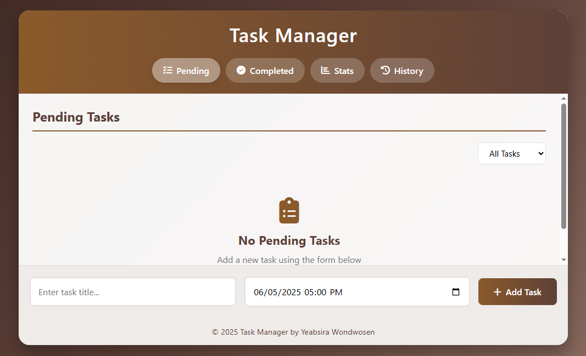

# Task Manager Application

 

A feature-rich task management web application with statistics visualization, deadline tracking, and history logging.

## Features

- ✅ **Task Management**
  - Add tasks with titles and deadlines
  - Mark tasks as completed
  - Delete tasks (moves to history)
  - Reschedule overdue tasks

- 📊 **Visual Statistics**
  - Interactive bar chart showing task distribution
  - Completion/overdue percentages
  - Filterable views (today/upcoming/overdue)

- ⏳ **History Tracking**
  - Permanent record of deleted tasks
  - Rescheduling history
  - Completion timestamps

- 🔒 **Data Persistence**
  - Automatically saves to browser's localStorage
  - Survives page refreshes
